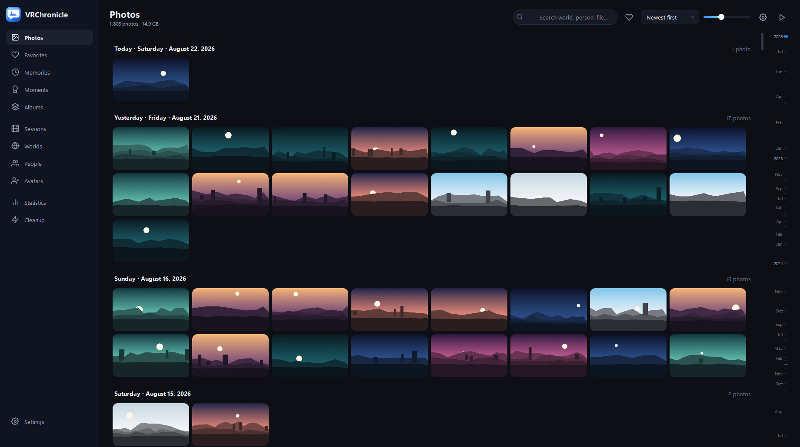
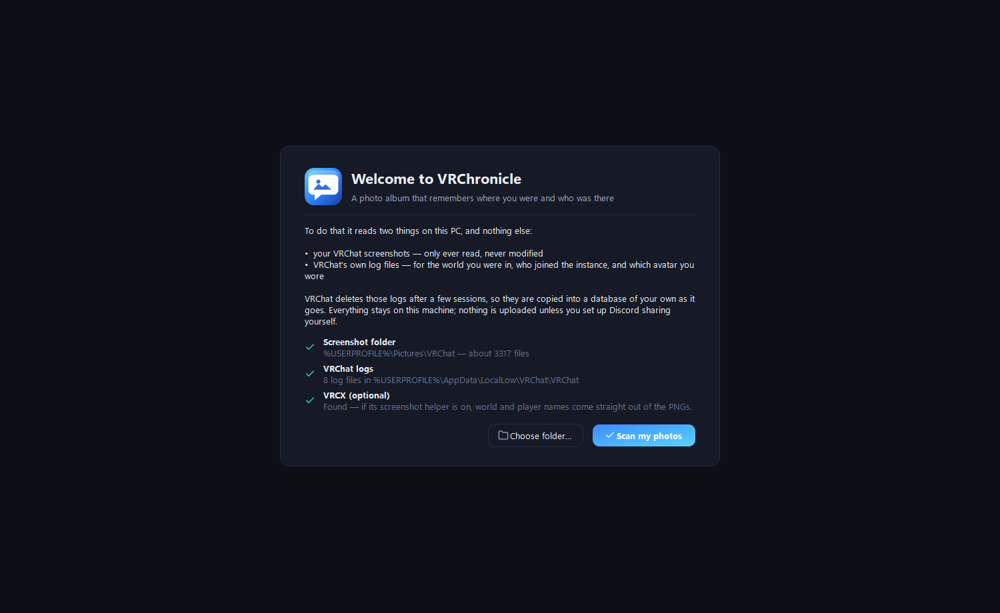
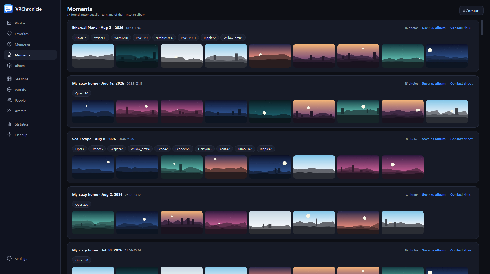
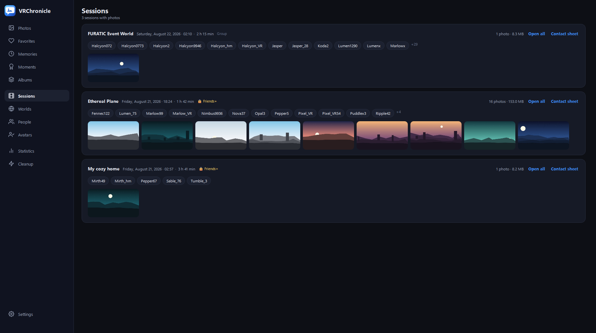
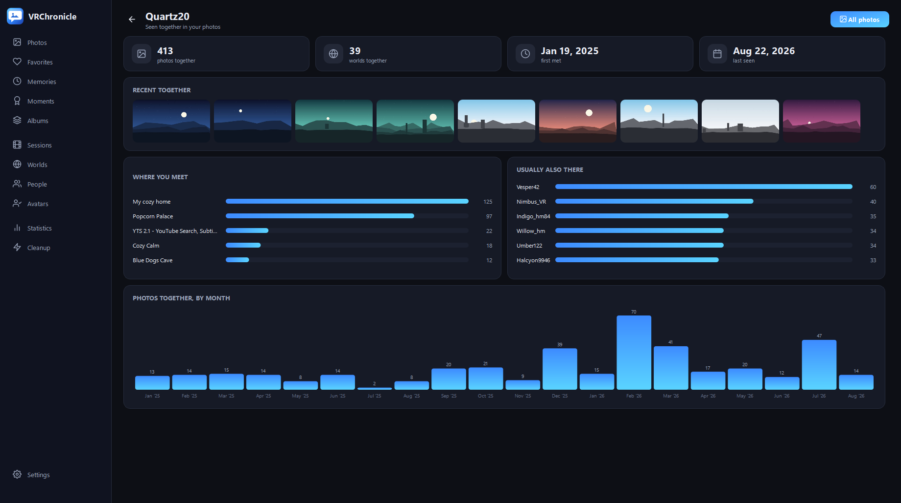
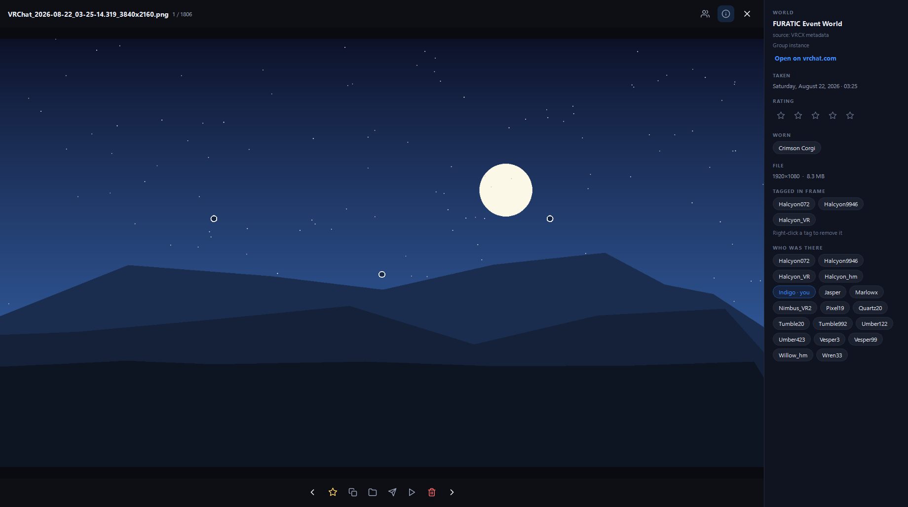
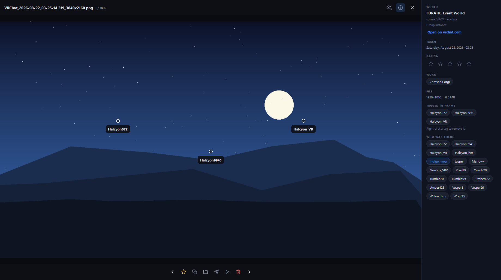
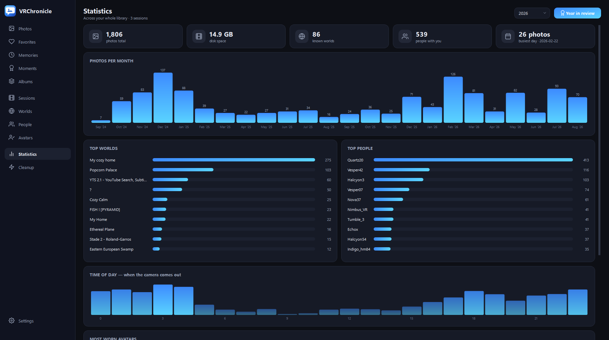
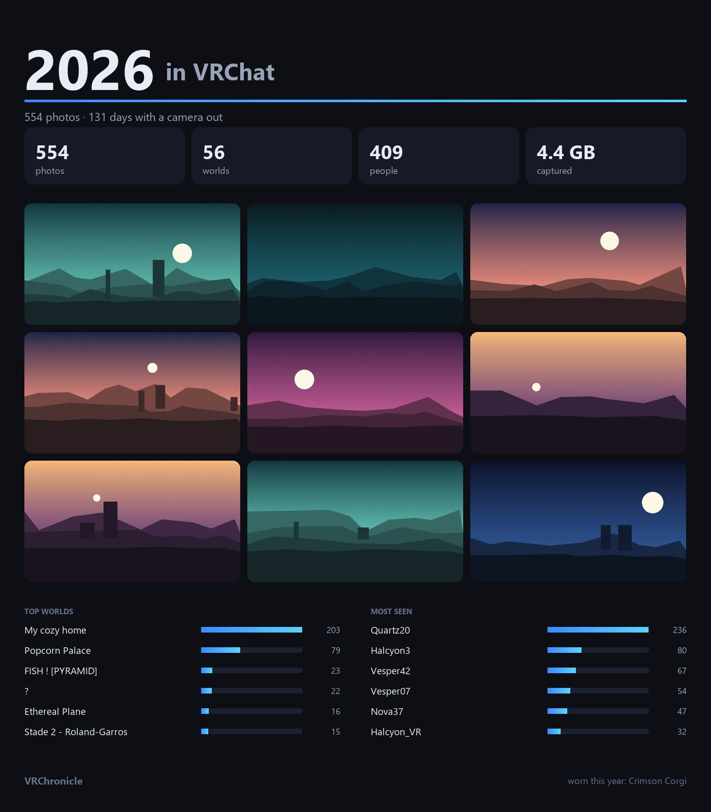
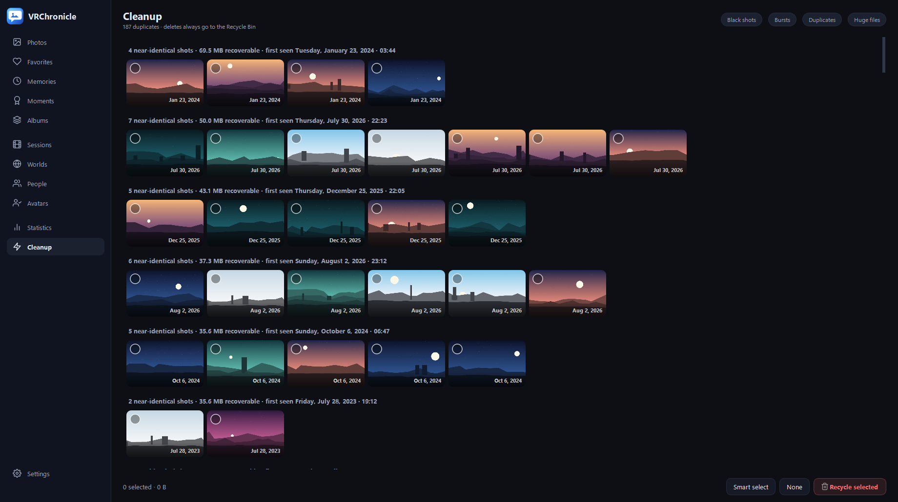

# VRChronicle — VRChat photo album

A gallery that knows **which world** each photo was taken in and **who was there** —
because it reads the same logs VRChat throws away.

**[⬇ Download the installer](https://github.com/fgs8z2n9qh-tech/VRChronicle/releases/latest)**
· Windows 10/11, no Python needed



> Every screenshot on this page comes from a stand-in library built by
> `tools\make_demo.py`: the structure is a real one — real worlds, real dates, real
> session and duplicate groupings — but every display name is made up and every photo
> is a generated scene. Publishing who somebody actually plays with, or the photos
> they are in, is exactly the thing this app warns you about.

## First run

It says what it is going to read, from where, before it reads any of it.



## Where the knowledge comes from

1. **VRCX metadata** — if VRCX runs with its screenshot helper, world + players are
   embedded in the PNG itself. Most reliable; travels with the file.
2. **VRChat logs** — `%USERPROFILE%\AppData\LocalLow\VRChat\VRChat\output_log_*.txt`
   gives a session timeline (`Joining wrld_…`, `OnPlayerJoined/Left`, and
   `Switching <you> to avatar <name>`), matched against each screenshot's timestamp.
   VRChat only keeps the last few log files, so **VRChronicle copies every session into
   its own database** — leave it running in the tray and the history never gets lost.

## Moments

A run of photos taken in one sitting becomes an event, with the world, the time span
and who was around. Save any of them as an album, or render it as a contact sheet.



## Sessions

One card per visit to a world: how long you stayed, who was there, and the shots you
took. The badge tells you whether it was a public, friends+, invite or group instance.



## People

The People page opens a profile rather than a plain filter: when you first met, where
you usually run into each other, and who else is normally in the room.



## The photo itself

World, avatar worn, instance type, rating, and everyone who was in the instance when
the shutter went. Click a name to see every photo you share with them.



### Tagging people in the frame

Press **T**, click where somebody is, and pick a name — the people the logs say were
in that instance are offered first, so it is usually one click. Hovering a marker
names them, the way a photo tag works anywhere else.



## Statistics and Year in review



One button renders a shareable poster for any year — stats, top worlds and people, and
a best-of grid picked for variety rather than nine shots of the same moment.



## Cleanup

Black shots, burst sequences, library-wide near-duplicates (perceptual hash plus a
brightness check, so different avatars on the same flat backdrop are not lumped
together) and huge PNGs. Everything goes to the **Recycle Bin** after asking; nothing
is ever deleted permanently.



## Everything else

- Timeline with a month/year rail, search by world / person / file, favorites, albums
- **Filters** — date range, instance type, minimum rating, photos or recordings
- **Star ratings** (1–5, or the number keys in the lightbox) alongside favorites
- **Recordings** — `.mp4` and friends sit on the timeline and open in your player
- **Memories** — "on this day, N years ago" + a random-day button
- **Instance privacy** — warns before a friends-only shot leaves the group
- **Desktop wallpaper** — from the tray, or right-click any photo
- **Verified backup** of the whole library to another drive, additive and never deleting
- **Headset import** — pull VRChat photos off a Quest over ADB
- **XMP sidecars** — world, people and avatar next to the photo for Bridge / Lightroom /
  darktable; the photos themselves are never modified
- **Sharing** — Discord webhook, optional burned-in caption band
- **In-world frame** — publish one photo to your own VRChat world (see [`world/`](world/))
- **Local API** — loopback + token, so a stream-deck key can push your newest shot to
  Discord in one tap
- Tray mode and start-with-Windows, so the log watcher keeps running

## Running from source

```powershell
py -3.12 -m venv .venv
.venv\Scripts\python.exe -m pip install -r requirements.txt
.venv\Scripts\python.exe run.py
```

Run the tests with `.venv\Scripts\python.exe -m pytest tests -q`. They cover the log
parser, moment detection, the database migration, and every path that can move a file —
plus a headless smoke test that builds every page.

Build the app and the shareable installer with `build.ps1` and `make_installer.ps1`;
pushing a `v*` tag does the same on GitHub Actions and attaches the installer to the
release.

Flags: `--tray` (start hidden), `--index` (headless index), `--no-index` (show the
library exactly as it is), `--data-dir DIR` (use a different library),
`--shot out.png --page sessions` (UI screenshot).

Helper scripts in `tools\`: `selftest.py` (headless index against the real library),
`make_demo.py` (pseudonymised copy for screenshots), `integrate.py` (register the app
with Atlas and Hexpad — backs their configs up first and never overwrites an occupied
slot).

## Data

Everything stays local in `%LOCALAPPDATA%\VRChronicle\` (vrchronicle.db, thumbs\,
config.json, exports\, crash.log). A library from the app's previous name is adopted
automatically on first run. Photos are only ever read — except the two Cleanup actions,
which move files to the Recycle Bin after asking.

## Licence

MIT — see [LICENSE](LICENSE). Not affiliated with or endorsed by VRChat Inc.
